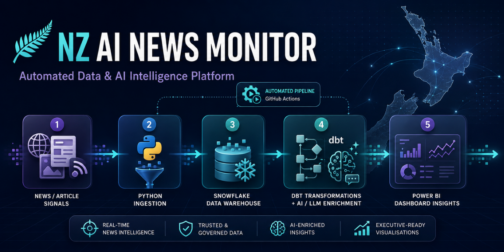

# Hi, I’m Lucy 👋

I’m a data analyst and analytics educator based in New Zealand, with a background spanning data analytics, business operations and international marketing.

I enjoy building practical solutions that connect data engineering, analytics, AI and business decision-making.

## ⭐ Featured Project: NZ AI News Monitor

An automated data and AI intelligence platform that collects New Zealand AI news, transforms and validates it in Snowflake, enriches articles using an LLM, and delivers decision-ready insights through Power BI.

**Architecture**

`Python → Snowflake RAW → dbt STG/INT → LLM Enrichment → dbt MART → Power BI`

**Key capabilities**

- Incremental ingestion with overlap and deduplication
- Automated NZ relevance filtering
- Snowflake data modelling across RAW, STG, INT and MART layers
- dbt transformations and data-quality testing
- LLM-powered sentiment and business-impact analysis
- Scheduled execution using GitHub Actions
- Interactive Power BI reporting

[Explore the NZ AI News Monitor →](https://github.com/lucy20080331-nz/nz-ai-news-monitor)

## ⭐ Featured Project: Google Merchandise Store GA4 Analytics

An end-to-end digital analytics solution that transforms nested GA4 e-commerce event data in BigQuery into tested, business-ready models and actionable customer and product insights in Power BI.

**Architecture**

`GA4 → BigQuery → dbt STG/INT/MART → Power BI`

**Project scale**

`4.30M Events | 360K Sessions | 270K Users | 1,398 Products | $362K Revenue`

**Key capabilities**

- Transform nested and repeated GA4 event data into analytics-ready models
- Build reusable dbt staging, intermediate and mart layers
- Profile data quality and prioritize reliable business signals
- Reconstruct session, customer and product-level analytics
- Model executive KPIs, engagement and conversion funnels
- Identify actionable customer and product segments
- Deliver interactive Executive, Customer and Product Power BI dashboards
- Prepare segmentation outputs for future CDP, Braze and CRM activation

[Explore the GA4 E-commerce Analytics Project →](https://github.com/lucy20080331-nz/ga4_analytics)

## ⭐ Featured Project: Cross-Cloud Game Analytics Pipeline

An end-to-end analytics pipeline that processes 5.7 million real Firebase game events across Google Cloud, AWS and Qlik Sense, transforming complex nested data into analysis-ready models and interactive insights.

**Architecture**

`Google BigQuery → Python → Amazon S3 → AWS Glue & Redshift Spectrum → Redshift STAGING/CORE/MART → Qlik Sense`

**Key capabilities**

- Migrated 114 days of Firebase event data from BigQuery to a partitioned S3 data lake
- Preserved raw nested data in Parquet while validating row counts and file integrity
- Used AWS Glue and Redshift Spectrum to query the RAW layer without duplicating storage
- Flattened nested event parameters, user properties, device, geographic and traffic data
- Built STAGING, CORE and MART layers with deduplication and reusable dimensional models
- Prepared 5.7 million events, 74,000 sessions and 15,000+ users for game-performance analysis
- Delivered an executive Qlik Sense dashboard for player activity, event trends and gameplay performance

[Explore the Cross-Cloud Game Analytics Pipeline →](https://github.com/lucy20080331-nz/Cross-Cloud-Game-Analytics)

## Other Projects

### Selwyn Campground Booking System

A Flask and MySQL operational system featuring availability checking, customer and booking management, reporting and forward-demand visualisation.

[View project →](https://github.com/lucy20080331-nz/selwyn-campground-booking-system)

### TreeTalk Community Forum

A Flask and MySQL community forum demonstrating authentication, role-based access control, content moderation and profile management.

[View project →](https://github.com/lucy20080331-nz/treetalk-community-forum-case-study)

### FreshHarvest E-commerce Case Study

An archived e-commerce case study demonstrating customer roles, ordering workflows, relational database modelling and sales reporting.

[View project →](https://github.com/lucy20080331-nz/freshharvest-ecommerce-case-study)

## Technical Skills

- **Data and analytics:** SQL, Python, Power BI, Excel and R
- **Cloud and data engineering:** AWS Redshift, S3, Glue, Redshift Spectrum, Google BigQuery, Snowflake, dbt, ETL/ELT and incremental pipelines
- **Business intelligence:** Power BI, Qlik Sense and data visualisation
- **AI:** LLM integration, machine learning and automated enrichment
- **Development:** Flask, MySQL, Git and GitHub Actions
- **Business:** Customer insights, marketing analytics and process improvement

## Current Focus

- Building reliable and automated data pipelines
- Connecting AI capabilities with practical business applications
- Turning complex data into accessible, decision-ready insights
- Continuing to develop cloud analytics and data-engineering skills
